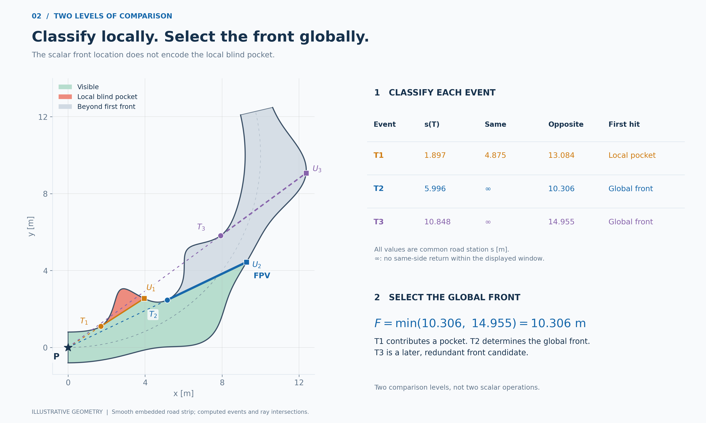
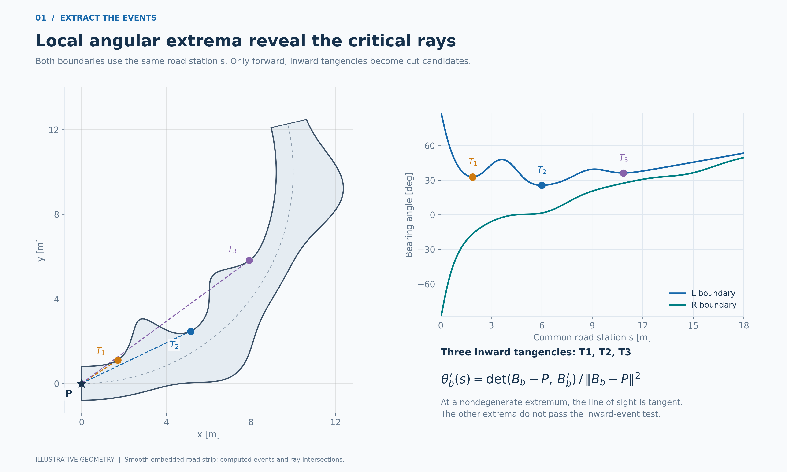
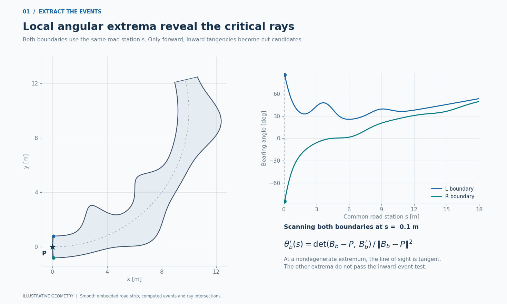
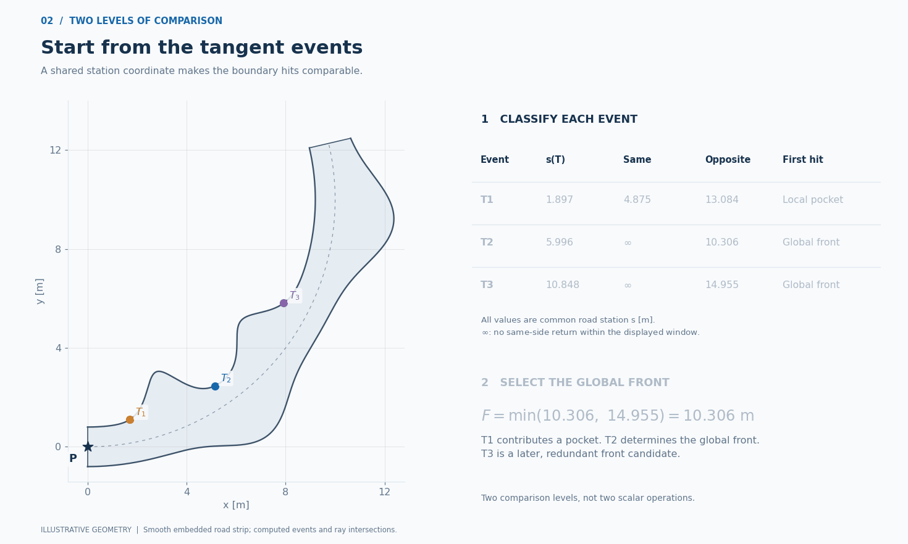
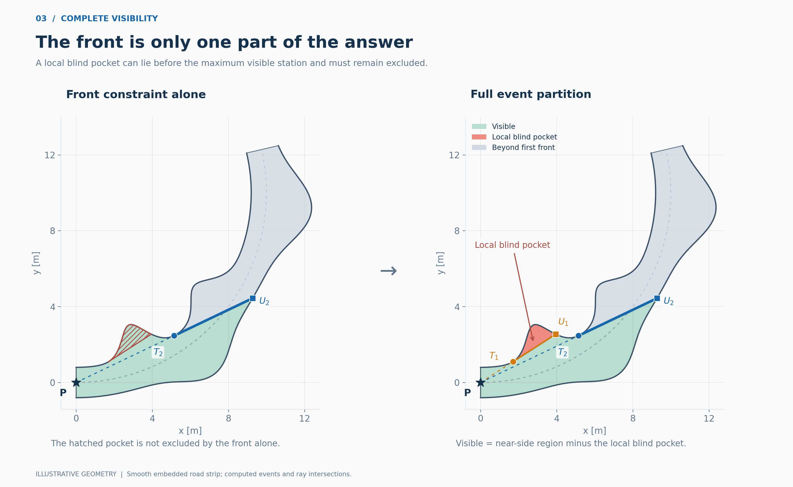

# ocp_fov

Geometry-based field of view for road-constrained driving, integrated with Frenet optimal control and vehicle dynamics.

This research prototype studies how road-boundary tangencies determine the farthest visible road station and the blind regions that remain before it. The key is to compare boundary intersections using a **shared longitudinal road coordinate**, then retain the events needed to describe the full visible region.



## The idea

1. **Find tangent events.** Local extrema of boundary bearing identify candidate tangencies from the observation point.
2. **Compare both boundaries along the same ray.** Compare the first eligible same-side and opposite-side hits by their shared road station. A same-side return creates a local blind pocket; an opposite-side hit creates a cross-road visibility front.
3. **Compare the cross-road candidates.** Under the geometric conditions in the mathematical note, the smallest candidate hit station identifies the first global front and the farthest visible road station.
4. **Keep the local events.** The farthest station alone does not describe the whole visible region. Local blind pockets must remain in the partition used for planning.

Here, “local optimization” means searching for local extrema of boundary angles. The current geometry code does not run a separate continuous nonlinear optimizer for that step.

### 1. Find the tangential events

The spatial rays and the boundary-angle curves share the same road coordinate. Eligible local extrema generate the candidate cuts.





### 2. Compare intersections, then compare front candidates

The animation first compares the two boundary hits on each ray, then compares only the cross-road front candidates. A local pocket remains relevant even after the global front is selected.



### 3. Preserve the full visibility partition

The region before the front can still contain a blind pocket. Keeping the full event partition excludes it.



These explanatory figures and animations use recomputed illustrative geometry based on the constructions in Section 6.3 and Figure 12 of Yanxing Chen's report, *Safety Ensured Driving with Predefined Field of View*. They are not reproductions of the original Monza experiment or new closed-loop planning results.

<details>
<summary>Original track visualization</summary>


This is the repository's original visualization artifact. Its implementation context is documented in the [code map](docs/code_map.md) and [implementation notes](docs/implementation_notes.md).

</details>

## Mathematical note

Read the standalone [formalization and correctness proofs (English PDF)](docs/proofs/geometric_visibility_proofs.pdf), or its [editable Markdown source](docs/proofs/geometric_visibility_proofs.md).

Extended derivations are provided in the [geometry note](docs/proofs/geometry_proof_review.md), [event-analysis note](docs/proofs/event_proofs.md), and [planning/control note](docs/proofs/control_proofs.md), all in English.

The note states the road-strip, common-coordinate, complete-event and nondegeneracy assumptions explicitly. It proves results for that mathematical construction. The existing sampled implementation is a research prototype and is not certified by the note. See [implementation notes](docs/implementation_notes.md) for the current correspondence and limitations.

## Quick start

Run commands from the repository root. Use Python 3.10 or newer for the repository as a whole.

```bash
python -m pip install -r requirements.txt
python examples/inspect_geometry.py --track Monza.csv --s0 930
```

The example reads the included track and inspects one geometry query. It does not launch the vehicle optimizer or overwrite the sample cache.

To inspect the existing cached track visualization:

```bash
python viz_fov.py fov_cache.json --track Monza.csv \
  --range 850:1100 --stride 2 --track_fill --show_rays
```

Pass `--track` explicitly: the checked-in cache contains an older machine-specific input path.

## Reproduce the explanatory visuals

```bash
python -m pip install -r requirements-docs.txt
python scripts/generate_idea_visuals.py \
  --out docs/figures --animations docs/animations
```

See the [Chinese visual guide](docs/visual_guide_zh.md) for the event values and geometry checks, and [build instructions](docs/BUILDING.md) for the optional PDF rebuild. The PDF is already included; rebuilding it is not needed to run the geometry example.

## Repository guide

| Start here | Purpose |
| --- | --- |
| `fov_extended.py` | Boundary geometry, tangent events and the two comparisons |
| `precompute_fov_cache.py` | Generate sampled viewpoint caches from a track CSV |
| `fov_to_frenet_bounds.py` | Convert cached geometry into lateral planning bounds |
| `plot_fov.py`, `viz_fov.py` | Existing single-view and track-level visualizations |
| `OPT_LAPTIME_FULLFOV.py` | Original FOV-constrained lap-time experiment |
| [Code map](docs/code_map.md) | All modules, historical variants and data dependencies |

The original experiment files and their paths are preserved. Optimization experiments additionally require `requirements-ocp.txt`; some entries need external modules and data not included here. They are not presented as a validated one-command reproduction. Read the [implementation notes](docs/implementation_notes.md) before interpreting their planning results.
