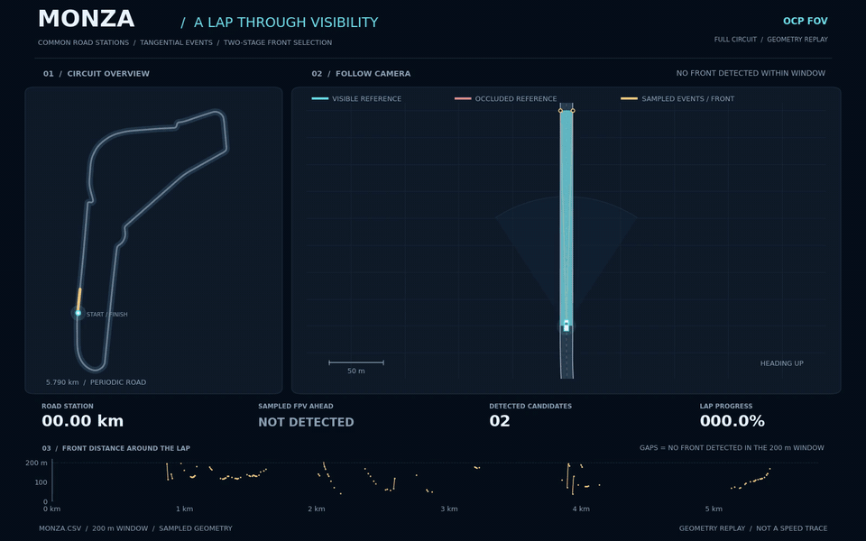

# Monza full-lap replay

这段动画沿 Monza 全圈推进观察点，把全赛道位置、局部可见性几何和最远可见位置的变化放在同一画面中。它延续原有动图的跟随视角，并增加全局地图和随圈进度变化的曲线。



[高清 MP4](animations/monza_full_lap.mp4) · [静态封面](figures/monza_full_lap_poster.png) · [返回 README](../README.md)

## 如何读图

- **全赛道地图**：给出观察点在整圈中的位置，把局部镜头对应到整条赛道。
- **跟随镜头**：展示赛道边界、观察点、切点和前沿点。ITP（切点）与 FPV（前沿点）标记来自仓库现有的几何计算。
- **前沿距离曲线**：横轴为观察点的道路序号，纵轴为 FPV 相对观察点的前向道路距离，即 `s_FPV − s_observer`。图中空缺表示没有检测到前沿，不是可见距离为零。

动画中的道路序号是共同的纵向道路坐标，不是左右边界各自独立的数组下标。经过起终点时，几何查询使用连续的周期延拓坐标，避免把道路在显示窗口内人为截断。

可见区域的填色采用独立的射线首次交点绘制方式：从观察点发出射线，与离散赛道边界求交，保留首次交点之前的区域。它用于帮助读者观察遮挡，不替代算法的 ITP/FPV 输出，也不构成连续几何证明或正式验证。

当金色算法输出与独立参考不吻合时，画面保留原始结果，并用金色虚线和 **REFERENCE DIFFERS** 标注差异。本次 720 帧中有 100 帧返回前沿；几何辅助检查采用 0.25 m 容差，在这 100 帧中发现 16 帧存在明显不吻合。核心算法代码保持不变。这是离散实现与离散参考之间的一致性记录，不是对连续几何定理的反例判定；检查数据见 [生成记录](figures/monza_replay_checks.json)。

如果现有算法返回 `None`，含义是当前采样和事件筛选没有给出前沿点；这不能推出前方整个查询窗口都可见。动画不会将这种情况解释为“200 m 全部可见”。

## 输入与计算设置

输入是仓库中的 `Monza.csv`。动画将赛道按周期闭合处理，在起终点附近继续查询下一圈的边界。

每个观察点调用现有的 `compute_fov_full`，沿用原跟随动画的主要设置：

| 参数 | 设置 |
| --- | --- |
| 前向查询范围 `look` | 200 m |
| 道路采样步长 `step` | 0.5 m |
| 角度筛选参数 `theta_min` | 4 |
| 其他核心算法参数 | 保持现有默认值 |

左右边界直接按照核心算法的定义构造，避免使用历史绘图脚本中不同的左右命名约定。新动画没有修改局部极值检测或两步比较的计算规则。

动画以道路序号匀速推进，一圈的播放时间只是展示节奏。它不是车辆动力学仿真，没有将播放速度解释为实际车速，也没有新增 OCP 或闭环控制实验。

## 复现

从仓库根目录运行：

```bash
python -m pip install -r requirements-docs.txt
python scripts/generate_monza_replay.py \
  --track Monza.csv --out docs/animations --figures docs/figures
```

默认输出包括：

| 文件 | 用途 |
| --- | --- |
| `docs/animations/monza_full_lap.mp4` | 高清播放版本 |
| `docs/animations/monza_full_lap.gif` | README 内嵌预览 |
| `docs/figures/monza_full_lap_poster.png` | 静态封面与文档插图 |

播放规格为：MP4 使用 1600 × 1000 分辨率、24 fps、720 帧；GIF 使用 960 × 600 分辨率、12 fps、360 帧。两者均以约 30 秒展示一圈。

## 原动图

仓库根目录中的 [`fov_follow_b.gif`](../fov_follow_b.gif) 和 [`fov_follow.gif`](../fov_follow.gif) 均予以保留，并在 README 中直接展示。新全圈动图作为补充，不覆盖这两份历史演示。

几何定理及其适用条件见 [English correctness proofs](proofs/geometric_visibility_proofs.pdf)。现有离散实现与数学模型的关系见 [implementation notes](implementation_notes.md)。
