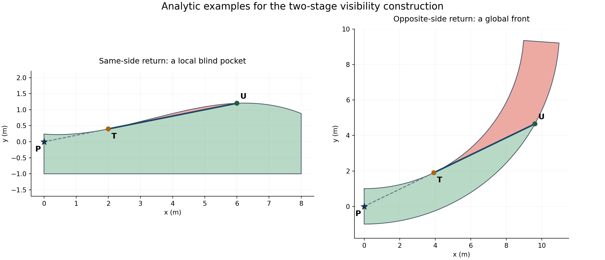

# Visibility from a Common Road Station and Tangential Events: Formalization and Correctness Proofs

Version: September 24, 2026. This note formalizes the method in Chapters 6-8 of Yanxing Chen's *Safety Ensured Driving with Predefined Field of View*, particularly Section 6.3, Equation (6.3), and Figures 12 and 17, together with the current `ocp_fov` implementation. The mathematical arguments below are newly developed derivations. This note does not assert that the original report already contained these theorems or that every branch of the implementation has been formally verified.

**Main result.** Under a globally embedded Frenet road-strip model, complete event enumeration, and the stated nondegeneracy assumptions, the report's two-stage rule admits a rigorous justification. First, comparing the common road stations of the first aligned returns on the same and opposite boundaries correctly identifies a local blind pocket or a cross-road front. Second, minimizing the hit station over opposite-side candidates selects the cross-road front nearest to the observer. A complete event partition further guarantees that this first front is visible and that its hit station equals the maximum visible road station. If the complete algorithm produces no opposite-side front, the maximum visible station is the end of the query window. An incomplete candidate set requires an additional visibility check on the selected tangent point. A complete partition must retain all local blind pockets and handle the end cap of a finite window. The essential geometric property is that the Frenet cross-sections are pairwise disjoint **convex straight segments**.

The presentation preserves the author's structure: local bearing extrema, same-ray comparison of the two boundaries, comparison across candidates, local blind pockets and a global front, and planning constraints. Exact intersections, degeneracy handling, and event completeness make the conditions behind this structure explicit. A general-purpose visibility algorithm is not substituted for the author's method.

## 1. Model, assumptions, and three distinct outputs

### 1.1 Road model

Let the centerline $c:[s_0,H]\to\mathbb R^2$ be parameterized by arc length. Set $t=c'$, let $N=Jt$ be the left unit normal, and let $\kappa$ denote signed curvature. For positive left and right widths $w_L,w_R>0$, define

$$
D=\{(s,n):s_0\le s\le H,\ -w_R(s)\le n\le w_L(s)\},
\qquad X(s,n)=c(s)+nN(s).
\tag{1}
$$

We impose the following geometric assumptions:

- **G1: Embedding.** The map $X$ is globally injective on $D$, and $1-\kappa(s)n>0$. The road $\Omega=X(D)$ is a topological closed disk. Positivity of the local Jacobian is not a substitute for global injectivity.
- **G2: Regularity.** In the smooth formulation, assume $c\in C^3$ and $w_L,w_R\in C^2$, so that the boundaries $B_L(s)=X(s,w_L(s))$ and $B_R(s)=X(s,-w_R(s))$ are at least $C^2$. Section 8 treats polygonal boundaries.
- **G3: Occlusion model.** Visibility is defined by two-dimensional point line of sight. A sightline may not pass through the road exterior, and there are no separate occluders inside the road. Finite sensor range, additional obstacles, and boundaries that are transparent from one side require an extended model.
- **G4: Common station.** Both boundaries use the same longitudinal coordinate $s$. Indices from independently sampled boundary arrays, or independently measured boundary arc lengths, cannot be compared directly.

Define $S:\Omega\to[s_0,H]$ as the first coordinate of $X^{-1}$. Every cross-section

$$
F_s=X(\{s\}\times[-w_R(s),w_L(s)])
\tag{2}
$$

is a convex straight segment, and cross-sections at different stations are disjoint. These are the substantive geometric conditions underlying the station-order arguments below.

A closed track must first be unwrapped into a finite forward window, and that window must still be verified to be an embedded disk. If a full lap is included and the initial and terminal caps are identified, the domain may become an annulus; the proofs for a hole-free disk do not apply directly.

The viewpoint $P=X(s_0,n_0)$ lies in the relative interior of the initial cap, with $-w_R(s_0)<n_0<w_L(s_0)$. The choice $n_0=0$ recovers the report's centerline viewpoint. Choose a forward interior point $P_\varepsilon$ sufficiently close to $P$ to identify the observer's side after partitioning. This auxiliary point does not replace the viewpoint. Because the finite set of forward events lies at $s>s_0$, a sufficiently small common $\varepsilon$ can be chosen.

### 1.2 Visibility and boundary conventions

The geometric visible set, allowing critical grazing contact, is

$$
V(P)=\{q\in\Omega:[P,q]\subseteq\Omega\}.
\tag{3}
$$

To exclude isolated zero-width rays that remain visible only through several exact cotangencies, define the regularized visibility region

$$
V_{\rm reg}(P)=\overline{\operatorname{int}_{\mathbb R^2}V(P)}^{\,\Omega}.
\tag{4}
$$

The two sets coincide in the usual nondegenerate case. When multiple cotangencies are retained, the area-based conclusion of the complete partition concerns $V_{\rm reg}$. A pointwise exact result for Equation (3) additionally requires classifying the event rays themselves. Planning should use an inner approximation with a positive safety margin.

### 1.3 Outputs that must be distinguished

1. The **complete visible set** $V$, including the partition induced by local blind pockets.
2. The **first global cross-road front** $Q_*$, which topologically separates the initial and terminal caps.
3. The **maximum visible road station** $S_{\max}=\max_{q\in V}S(q)$, and the free distance along the actual braking path.

Section 5 proves $S_{\max}=S(U_*)$ under the stated conditions, providing a precise interpretation of the report's FPV terminology. The station difference $S(U_*)-s_0$ is not the same quantity as the Euclidean distance to the front along the vehicle's heading.

## 2. Defining local optima as tangential events

For boundary $B_b(s)$, write $r_b(s)=B_b(s)-P$. On a continuous branch of the bearing angle, define

$$
\theta_b(s)=\operatorname{atan2}(\det(h,r_b(s)),h^Tr_b(s)),\qquad h=t(s_0).
\tag{5}
$$

### Proposition 1: Equivalence of stationary bearing and tangency

If $B_b(s)\ne P$, then

$$
\theta_b'(s)=\frac{\det(B_b(s)-P,B_b'(s))}{\|B_b(s)-P\|^2}.
\tag{6}
$$

Consequently, $\theta_b'(s_T)=0$ if and only if the sightline $P T$ is parallel to the boundary tangent. If $\theta_b''(s_T)\ne0$ as well, the point is a strict local extremum. A general stationary point, however, need not be a strict extremum.

**Proof.** Differentiating the argument of a planar vector gives Equation (6). The denominator is positive, and the numerator vanishes exactly when the two nonzero vectors are parallel. The nonzero second-derivative test yields the final statement. $\square$

At a tangent point,

$$
\theta_b''(s_T)=\frac{\det(T-P,B_b''(s_T))}{\|T-P\|^2}.
\tag{7}
$$

Thus, the report's local optimization can be stated precisely as a one-dimensional bearing-extremum or tangential-event search. It does not require a separate continuous trajectory optimizer.

### 2.1 Tangencies admitted to the two-boundary comparison

For $T=B_b(s_T)$, let $d=(T-P)/\|T-P\|$. A **forward inward tangential event** satisfies

$$
s_T>s_0,\qquad
T+\rho d\in\operatorname{int}\Omega\quad(0<\rho<\delta),\qquad
S(T+\rho d)>s_T\quad(0<\rho<\delta)
\tag{8}
$$

for sufficiently small $\delta>0$. The last two conditions mean, respectively, that extending the tangent enters the road interior and that the road station increases along this extension. They are local geometric conditions and **do not require prior proof that $T$ is visible from $P$**. Hidden events may be retained as redundant partition candidates.

Under Frenet regularity, forward orientation can be checked by $d^Tt(s_T)>0$, since

$$
\frac{d}{d\rho}S(T+\rho d)=\frac{d^Tt(S(T+\rho d))}{1-\kappa(S(T+\rho d))n(T+\rho d)}.
\tag{9}
$$

For a nondegenerate smooth tangency, inwardness is determined by the inward boundary normal and curvature. Orient each boundary by increasing $s$. Let $\sigma_b=+1$ if the road lies to the left of this orientation, and $\sigma_b=-1$ if it lies to the right. Writing $B_b'(s_T)=\lambda d$ with $\lambda>0$, the inward condition is equivalent to

$$
\sigma_b\det(B_b'(s_T),B_b''(s_T))<0.
\tag{10}
$$

With the physical left/right convention of Equation (1), an inward tangency on the left boundary is a local bearing minimum, whereas one on the right boundary is a local bearing maximum. Exchanging the boundary labels or reversing the angular cross-product convention also exchanges maxima and minima. An implementation should check Equation (8) or (10), rather than rely solely on variable names.

**Precise interpretation of the statement that every local optimum implies a blind region.** Every nondegenerate inward event satisfying Equation (8) induces an occlusion partition once a valid return intersection has been found. The blind regions of different events may be nested or redundant; the events are not necessarily in one-to-one correspondence with distinct visible boundaries of blind regions. An arbitrary bearing stationary point, an outward tangency, or an extremum at a window endpoint does not automatically have this property.

## 3. Unified algorithm retaining the two-stage station comparison

For each forward inward event $T_j=B_{b_j}(s_j)$, define the exact hit set

$$
A_{j,b}=\{s>s_j:B_b(s)=T_j+\rho d_j\text{ for some }\rho>0\}.
\tag{11}
$$

Let

$$
a_j=\inf A_{j,b_j},\qquad b_j^{\rm hit}=\inf A_{j,\bar b_j},
\tag{12}
$$

with the infimum of an empty set taken as $+\infty$. To distinguish the boundary label $b_j$ from the opposite-boundary hit value, abbreviate the latter as $o_j=b_j^{\rm hit}$. The assumption of finitely many isolated roots ensures that every finite first value is attained. The tangent point itself must not be counted as a return intersection.

**Stage 1:**

- If $a_j<o_j$, set $U_j=B_{b_j}(a_j)$. This is a same-side event producing a local blind pocket.
- If $o_j<a_j$, set $U_j=B_{\bar b_j}(o_j)$. This is an opposite-side event producing a global-front candidate.
- If neither side boundary is hit, test the terminal cap. Failure to find a side-boundary hit must not automatically be interpreted as visibility of the whole window.
- Equal hit values, collinear overlaps, multiple cotangencies, and other degeneracies require separate handling. An arbitrary tie-break does not establish general exactness.

**Stage 2:** If the opposite-side candidate set $\mathcal K_{\rm opp}$ is nonempty, choose

$$
j_*\in\operatorname*{arg\,min}_{j\in\mathcal K_{\rm opp}}o_j,\qquad
F=o_{j_*},\qquad Q_*=[T_{j_*},U_{j_*}].
\tag{13}
$$

Retain

$$
\mathcal T_{\rm pre}=\{T_j:s_j\le F\},\qquad
\mathcal U=\{\text{actual blind pockets generated by same-side events}\}.
\tag{14}
$$

If no opposite-side candidate exists, report that no complete cross-road front has been found, together with the window limit, local blind pockets, and certification status. The value $H$ can be returned as the visible progress limit only after the remaining region in the window has been certified visible.

```text
Input: Embedded road strip, common station s, viewpoint P, window end H.
1. Enumerate all critical boundary-bearing events; check forward orientation
   and inwardness.
2. For each event T:
   On the same ray T + rho d, find the minimum forward stations a and o
   on the same and opposite boundaries, respectively.
   Compare a and o to form a same-side pocket or an opposite-side crosscut.
   Handle the terminal cap, corners, and degeneracies in explicit branches.
3. Select the minimum hit station among opposite-side candidates;
   retain T_pre and the local blind pockets.
4. Construct regions from actual boundary arcs and partition segments.
   Take the closure of the interior cell adjacent to the observer.
5. Return the complete visible set or a certified inner approximation,
   FPV, ITP, local blind pockets, and status flags.
6. Decompose the certified free region into convex components or
   cross-sectional intervals, then construct planning and braking constraints.
```

The two-stage comparison refers to two organizational levels. It does not mean that the whole algorithm performs only two comparisons or has constant complexity.

## 4. Correctness of Stage 1: Why station values can be compared

### Lemma 2: Station monotonicity along a road-contained straight segment

If a straight segment $Q\subseteq\Omega$, then $S$ is monotone along $Q$, with a constant value permitted. Consequently, if its endpoint stations satisfy $s_T<s_U$, then

$$
S(Q)=[s_T,s_U].
\tag{15}
$$

**Proof.** Parameterize the segment by $q(\tau)=(1-\tau)T+\tau U$. Every level set of the continuous function $f(\tau)=S(q(\tau))$ is

$$
f^{-1}(s)=\{\tau:q(\tau)\in F_s\}
$$

It is an interval because both $F_s$ and $Q$ are convex. If a continuous real-valued function is not monotone, there is a three-point sequence on which it first increases and then decreases, or first decreases and then increases. Choosing a level between the middle extremal value and the two outer values, the intermediate value theorem yields two equal-valued points separated by a point at a different level. The resulting level set is disconnected, a contradiction. Hence $f$ is monotone. Its endpoint values determine the direction of monotonicity and its range. $\square$

The lemma concerns straight segments **entirely contained in the road**. It must not be generalized to claim that all disconnected intersections of an arbitrary ray with the road are globally ordered by station. The next theorem proves only the first-hit relation needed by the algorithm.

### Theorem 3: The first forward station hit is the first boundary hit after the tangency

Let $T$ satisfy Equation (8). Let $Q=(T,U)$ be the first uninterrupted interior segment of the ray after $T$, so that

$$
(T,U)\subset\operatorname{int}\Omega,\qquad U\in\partial\Omega,
\tag{16}
$$

Assume that $U$ is a transverse exit: a nonzero ray segment immediately beyond $U$ lies outside the road. If $U$ is not on an end cap, the minimum-forward-station comparison in Stage 1 selects precisely $U$, and $S(U)>S(T)$.

**Proof.** Lemma 2 and Equation (8) imply $S(U)>s_T$, with $Q$ attaining every intermediate station. There is no other boundary hit between $T$ and $U$. Suppose that a later point $W$ on the ray is a boundary hit with

$$
s_T<S(W)<S(U).
$$

By the intermediate value theorem, there is a point $Z\in Q$ at the same station as $W$. Both points belong to the convex straight segment $F_{S(W)}$, so $[Z,W]\subseteq F_{S(W)}\subseteq\Omega$. However, $[Z,W]$ follows the ray through the exterior segment immediately beyond $U$, a contradiction. If $S(W)=S(U)$, applying the same convexity argument to $[U,W]$ also gives a contradiction. Thus, no farther admissible forward hit can have a station smaller than or equal to $S(U)$. The minimum forward hit station is exactly $S(U)$. $\square$

This establishes the geometric meaning of the author's first comparison. It requires neither monotonicity of the bearing or alignment predicate along an entire boundary nor a prior visibility check on $T$.

## 5. Same-side pockets, opposite-side fronts, and correctness of Stage 2

A closed segment $Q=[T,U]$ satisfying Equation (16) is a **proper crosscut** of the road: its endpoints lie on the boundary and its open segment lies in the interior.

### Theorem 4: Occlusion induced by a radial crosscut

Suppose $P,T,U$ lie on the same ray in that order, and $Q$ is a proper crosscut. The cut separates the road interior into two connected components. Let $W_Q$ be the component not containing $P_\varepsilon$. Every $q\in W_Q$ off the supporting line is invisible. If $U$ satisfies the transverse-exit condition of Theorem 3, all of $W_Q$ is invisible.

**Proof.** First choose a local half-disk near $P$ containing no crosscut. Since $P$ is in the relative interior of the straight initial cap, every visible segment entering the road from $P$ has an initial portion in the same local interior component as $P_\varepsilon$. Thus, the observer's side is unambiguously defined. By the Jordan separation theorem, every continuous path inside the road from this side to $W_Q$ must pass through $Q$. If $q$ were visible, $[P,q]$ would be such a path. In the noncollinear case, the lines $Pq$ and $PT$ intersect only at $P$, whereas $P\notin Q$. Hence $[P,q]$ cannot cross $Q$, a contradiction. In the collinear case, a point before $Q$ or in the opposite direction has a sightline that does not meet $Q$, so separation again rules out its visibility if it belongs to $W_Q$. A point beyond $U$ has a sightline containing the exterior segment immediately after $U$, and is also invisible. The cut $Q$ itself belongs to the component boundary, not to $W_Q$. $\square$

**Scope of the result.** If multiple grazing contacts are allowed and a transverse exit is not required, the noncollinear argument alone does not exclude every isolated visible collinear point. Using $V_{\rm reg}$, or classifying these rays separately, addresses this case.

### Theorem 5: Same-side returns yield local pockets; opposite-side returns yield cross-road fronts

Under the conditions of Theorems 3 and 4:

1. If $T$ and $U$ lie on the same side boundary, the boundary arc $B_b([s_T,s_U])$ together with $[U,T]$ forms a Jordan curve. The enclosed region inside the road is $W_Q$. It contains neither end cap and is a local blind pocket.
2. If $T$ and $U$ lie on opposite side boundaries, $Q$ separates the initial cap from the terminal cap. The road interior on the terminal-cap side is invisible, so $Q$ is a global occlusion front.

**Proof.** Use $X^{-1}$ to map the road homeomorphically onto a rectangular strip. The short boundary arc between two same-side endpoints passes through neither cap; together with the crosscut it encloses a local disk. The remaining component connects the two caps. An opposite-side crosscut joins the two long sides of the rectangle and therefore separates the two short sides. These topological relations are preserved by the homeomorphism. Occlusion follows from Theorem 4. $\square$

A genuine same-side blind pocket must be closed by the **boundary arc and tangent segment**. Since $P,T,U$ are collinear, the triangle $(P,T,U)$ has zero area and cannot represent the blind lobes in Figures 12 and 17 of the report.

### Lemma 6: Opposite-side radial crosscuts have consistently ordered endpoints

Radial crosscuts with distinct directions do not intersect: their supporting lines meet only at $P$, and $P$ lies on none of the crosscuts. If both crosscuts connect the left and right boundaries, their endpoint order on the left boundary agrees with their endpoint order on the right boundary.

**Proof.** If the orders were reversed, the four endpoints would alternate along the road's Jordan boundary. A crosscut connecting the first pair would separate the endpoints of the second pair, forcing the second crosscut to intersect it. This contradicts disjointness. $\square$

### Theorem 7: Minimizing the hit station selects the first global front

For every valid opposite-side candidate, denote the left and right endpoint stations by $(\ell_j,r_j)$. Because the hit station is always forward of the tangent station,

$$
o_j=S(U_j)=\max\{\ell_j,r_j\}.
\tag{17}
$$

Equation (13) therefore selects the opposite-side crosscut topologically nearest to the observer.

**Proof.** Lemma 6 gives the crosscuts a consistent order. If $Q_i$ precedes $Q_j$, then $\ell_i<\ell_j$ and $r_i<r_j$, and hence

$$
\max\{\ell_i,r_i\}<\max\{\ell_j,r_j\}.
$$

By Equation (17), minimizing $o_j$ is equivalent to selecting the first complete cross-road front in this order. $\square$

This is the justification for the author's second comparison. The ordering follows jointly from a common station, forward returns, and disjoint crosscuts. It does not follow from directly comparing unrelated left- and right-boundary array indices.

### Theorem 8: When FPV equals the maximum visible road station

Let a valid opposite-side front $Q=[T,U]$ satisfy $s_T<s_U$, the transverse-exit condition, and $[P,T]\subseteq\Omega$. Then

$$
\max_{q\in V(P)} S(q)=s_U.
\tag{18}
$$

**Proof.** By Lemma 2, the maximum station on $Q$ is $s_U$. The substrip $\{q:S(q)>s_U\}$ is connected, does not intersect $Q$, and connects to the terminal cap. It therefore lies entirely on the far side of $Q$. Theorem 4 makes it invisible, so every visible point satisfies $S(q)\le s_U$. Conversely, $[P,T]$ is visible and $[T,U]\subseteq\Omega$, giving $[P,U]\subseteq\Omega$. Thus $U$ itself is visible and attains the upper bound. $\square$

The result is more than a conservative first cutoff: in this model, it is the actual maximum visible road station. Without visibility of $T$, the argument still gives the upper bound $S_{\max}\le s_U$, but does not establish that the bound is attained. The complete partition provides the additional conclusion below.

## 6. Recovering the complete visible set from all local events

### 6.1 Event conditions required for completeness

In addition to G1-G4, the basic completeness theorem assumes:

- **E1: Finitely many events.** Relevant tangencies, corners, and ray intersections are finite in number. $C^2$ regularity alone does not imply finitely many extrema. Finite piecewise algebraic boundaries, or an explicit finite-root assumption, can be used.
- **E2: General position.** Tangencies are nondegenerate, the first hit after each generated window is a transverse exit, and distinct effective events do not share a ray. Section 8 discusses degeneracies.
- **E3: Complete enumeration.** Every inward tangency or occluding corner capable of generating an interior boundary of the visible set is enumerated. Empirical curvature, angular-amplitude, or minimum-spacing thresholds satisfy this assumption only if they are proved not to discard relevant events.
- **E4: Closed query window.** The terminal cap is included as an intersectable boundary, or it has been verified that every relevant occlusion window hits a side boundary first. Blind regions truncated at $H$ must not be ignored.

**Proposition 9: Every interior visibility boundary lies on a critical-event ray.**

In the finite, nondegenerate model above, every $q\in\operatorname{int}\Omega\cap\partial V_{\rm reg}$ lies on a radial window generated by a visible inward tangency or an occluding corner.

**Proof.** First, $V$ is closed. If $q_m\to q$ and $[P,q_m]\subseteq\Omega$, then the limit point at any fixed segment parameter remains in the closed set $\Omega$. Thus $[P,q]\subseteq\Omega$. It follows that $V_{\rm reg}\subseteq V$, so the interior boundary point $q$ is itself visible.

Since $P$ lies in the relative interior of the straight initial cap, the ray toward the visible interior point $q$ is strictly inward at $P$. Its short initial portion is stable under small perturbations within the local half-plane. If the remaining compact segment had no boundary contact, it would have uniformly positive clearance, and all sufficiently small perturbations of $q$ would remain visible. This contradicts $q$ being a visibility-boundary point. Hence $(P,q)$ has a boundary contact $T$. That contact cannot be transverse, because then part of the sightline would lie outside the road, contradicting visibility of $q$. It is therefore a smooth tangency or an occluding corner. General position excludes multiple contacts on the same ray. Extending from $T$ to the first return $U$ forms a proper window containing $q$. Lemma 2 and local regularity give increasing station, while the window itself establishes inward entry after $T$. Thus Equation (8) holds. Nondegeneracy ensures a change in occlusion state between adjacent ray directions. The algorithm therefore enumerates this window. $\square$

### Theorem 10: Completeness of the combined event partition

Generate every valid radial crosscut. Let $C_P$ be the connected component of $\operatorname{int}\Omega\setminus\bigcup_jQ_j$ containing $P_\varepsilon$, and define the output precisely as

$$
K=\overline{C_P}^{\,\Omega}.
\tag{19}
$$

Then $K=V_{\rm reg}(P)$. In general position, with no isolated grazing rays, $K=V(P)$. This construction is not equivalent to removing open blind regions from the closed road while retaining every original boundary point. Hidden side-boundary arcs and hidden event segments cannot be retained without classification.

**Proof.**

1. **No visible interior point is removed.** Theorem 4 establishes that every $W_j$ is invisible. Valid cuts generated by hidden tangencies have the same property and may therefore remain as redundant events.
2. **The remainder is connected.** Distinct radial crosscuts do not intersect. The far-side components of disjoint crosscuts in a disk are either disjoint or nested. Removing them leaves the single connected component containing $P_\varepsilon$. Equivalently, cut the disk one crosscut at a time, retaining only the observer's side after each cut.
3. **No invisible interior point is retained.** Proposition 9 places every visible/invisible interface on an enumerated radial crosscut. The remaining connected interior contains visible points near $P$ and contains no visibility interface. It therefore cannot also contain an invisible point: otherwise, a path within it joining the two points would cross a visibility interface that had not been removed, a contradiction.
4. Taking the relative closure of this remaining interior gives $V_{\rm reg}$. Under nondegeneracy there are no additional isolated visible rays, so the result is $V$. $\square$

Thus, **retaining all local events produces a complete partition, rather than merely supporting the selection of one FPV**. An event-based blind-region representation must allow nesting, overlap, and redundancy. The regions must be combined by set union; the number of events does not determine the number of connected blind components.

### 6.2 Combining the minimum front with $\mathcal T_{\rm pre}$

The far-side regions of opposite-side fronts are nested in their order along the road. Removing the far-side region of the first front therefore already removes those of all subsequent opposite-side fronts. Same-side blind pockets must still be combined within the retained near-side region.

By the station upper-bound argument of Theorem 8, the near side of the first front has station at most $F$. A forward crosscut starting at $s_T>F$ lies entirely in $S\ge s_T>F$ and cannot form a boundary of the near-side visible region. Retaining $\mathcal T_{\rm pre}=\{T:s_T\le F\}$ therefore preserves every initiating event relevant to this partition, although some retained events may be redundant.

### Corollary 10a: The complete algorithm automatically returns the true maximum visible station

Under all the conditions of Theorem 10, if an opposite-side candidate exists, the first front $Q_*$ selected by Equation (13), including its endpoints, is visible. Consequently,

$$
F=\min_{j\in\mathcal K_{\rm opp}}S(U_j)=\max_{q\in V(P)}S(q).
\tag{20}
$$

**Proof.** Every other radial crosscut $R$ is disjoint from $Q_*$, so $Q_*^\circ$ lies entirely on one side of $R$. If $R$ bounds a same-side blind pocket, the closure of its far-side component touches only one side boundary and cannot contain a crosscut $Q_*$ joining both side boundaries. A pocket cut off by a side-boundary-to-terminal-cap window touches only that side boundary and the cap, so the same argument applies. If $R$ is an opposite-side front, Theorem 7 places $Q_*$ on its near side. Hence no other shadow component removes $Q_*$. Because the crosscuts are finite and disjoint, every interior point of $Q_*$ has a retained local neighborhood on its near side. Therefore $Q_*\subseteq\overline{C_P}^{\,\Omega}=V_{\rm reg}\subseteq V$; taking the closure also includes its endpoints. Theorem 8 then yields Equation (20). $\square$

This completes the correctness argument for the full algorithm without requiring a visibility filter for every candidate. An implementation may still check $[P,T_*]\subseteq\Omega$ independently, especially when completeness of its event enumeration has not been proved.

### Corollary 10b: Without an opposite-side front, the complete algorithm reaches the window end

If all the conditions of Theorem 10 hold and there is no crosscut joining the left and right boundaries, then $S_{\max}=H$.

**Proof.** Same-side pockets do not touch the terminal cap. Parameterize the cap by its normal coordinate $n$, increasing from right to left. A left-boundary-to-cap window removes a left-end interval $[n_L,w_L(H)]$; a right-boundary-to-cap window removes a right-end interval $[-w_R(H),n_R]$. Every left/right pair satisfies $n_R<n_L$. Otherwise, their boundary endpoints would alternate and force the cuts to intersect, or the cuts would share a cap endpoint, both contrary to general position. Since there are finitely many windows, $\max n_R<\min n_L$, leaving a nonempty open interval of the cap. If either class is absent, use the corresponding cap endpoint as its bound. This interval is not removed by any shadow and belongs to $\overline{C_P}^{\,\Omega}=V$, so station $H$ is attained. $\square$

The complete mathematical algorithm may therefore return $H$ when there is no opposite-side front, while still retaining local blind pockets. A sampled or thresholded implementation that merely fails to detect a front cannot invoke this corollary without the completeness conditions.

## 7. Stability under look-ahead expansion

### Theorem 11: Window-expansion stability when the prefix is preserved

Let $F(H)$ be the result of Equation (13). Expand the window from $H$ to $H'>H$. If

1. the geometry, samples, candidates, thresholds, and filtering outcomes within the old window are unchanged;
2. new candidate starts and new samples occur only beyond the old window;
3. only hits with $s_{\rm hit}>s_T$ are accepted; and
4. the old window already has a finite result $F(H)<H$,

then $F(H')=F(H)$.

**Proof.** Hits and classifications within the old window are unchanged, so the old minimum candidate remains. Every previously unavailable new hit lies beyond $H$. The hit of a new tangent must also have a station greater than that tangent's station, so it cannot occur before $H$. None of these values can be smaller than $F(H)$. Moreover, a newly found later same-side hit cannot invalidate an already earlier opposite-side hit. The two inequalities give the stated equality. $\square$

This theorem does not need the report's claim that the alignment predicate is monotone along the boundary. Changing angular tolerances, resampling the boundary, applying whole-window peak filters, or temporarily treating an old window endpoint as an extremum can violate prefix preservation and requires separate analysis.

## 8. From the continuous theorems to a discrete implementation

### 8.1 Polygonal roads and exact segment intersections

For a polygonal road, boundary vertices must be included in the event set, with the preceding and following edge directions used to identify occluding corners. A polygon vertex is not a differentiable tangency. If the road still admits pairwise disjoint convex straight cross-sections, Lemma 2 and both comparison theorems continue to hold.

The nonparallel intersection between the ray $T+\rho d$ and an edge $A+u e$, where $e=B-A$, is

$$
\rho=\frac{\det(A-T,e)}{\det(d,e)},\qquad
u=\frac{\det(A-T,d)}{\det(d,e)}.
\tag{21}
$$

Retain intersections with $\rho>0$ and $0\le u\le1$, excluding the self-contact at the tangent point. In the parallel collinear case, handle the overlap interval explicitly. The station assigned to an intersection must come from the specified common road parameterization. Linear interpolation along an edge gives a result for the corresponding polygonal road model; without an error analysis, it is not an exact solution for the original smooth boundary.

### Proposition 12: A fixed angular tolerance necessarily admits false returns near tangency

Suppose $B(s_T+\Delta)-T=\lambda d\Delta+\tfrac12 B''(s_T)\Delta^2+o(\Delta^2)$, with $\lambda>0$. The alignment ratio used in the current formulation satisfies

$$
\frac{|\det(d,B(s_T+\Delta)-T)|}{d^T(B(s_T+\Delta)-T)}
=\frac{|\det(d,B''(s_T))|}{2\lambda}\Delta+o(\Delta).
\tag{22}
$$

For every fixed $\varepsilon_{\rm dir}>0$, a sufficiently close subsequent boundary sample therefore passes the approximate-alignment test, even if it is not a true return intersection.

**Proof.** The numerator is second order in $\Delta$, while the denominator is positive and first order. Dividing gives the result. $\square$

Denser sampling alone therefore does not make this approximate hit test converge to the first return in Theorem 3. The tangent root must be isolated from the true next intersection, or a proved root-isolation and error-interval method must be used. Skipping a fixed single sample is insufficient.

### Proposition 13: A fixed adjacent-sample peak threshold is not complete under grid refinement

At a nondegenerate bearing extremum, the bearing difference between adjacent samples is $O(\Delta s^2)$. If adjacent-sample differences are filtered using a fixed positive threshold, sufficiently fine grids therefore discard genuine smooth extrema.

**Proof.** Apply a second-order Taylor expansion at $\theta'(s_T)=0$. $\square$

### 8.2 Available error certificates

Suppose an intersection function $g(s)$ satisfies $|g'|\ge\mu>0$ in an isolated-root neighborhood, an approximation satisfies $\|\widehat g-g\|_\infty\le\eta$, and root existence is certified, for example by opposite endpoint signs. Then the corresponding root-position error is at most $\eta/\mu$. This follows from the mean value theorem. The same argument applies to tangencies using $g=\theta'$, provided $|\theta''|$ has a positive lower bound.

To preserve the event classification, the station intervals of the two competing hits must also be proved disjoint. Overlapping intervals require refinement or an unresolved classification, rather than a forced decision. Near a topological degeneracy, a single global sampling step cannot by itself guarantee correctness.

### 8.3 Relationship between empirical filters and the theoretical algorithm

Curvature thresholds, angular-amplitude thresholds, minimum distances, event spacing, unknown-zone (UZ) merging, and artifact removal may remain useful engineering strategies, subject to the following distinctions:

- The completeness theorem applies to a list that omits no relevant event. Empirical success of a threshold is not a proof of E3.
- Merging blind regions conservatively shrinks visibility if it enlarges the unknown set. Removing any part of a blind region requires an additional visibility certificate.
- Events and their certificates must be reassessed after boundary resampling, viewpoint changes, or tolerance changes.
- A no-hit result must distinguish the genuine absence of a global front from window truncation, numerical failure, and event removal by filtering.

### 8.4 Complexity

With $N$ boundary segments in total and $K$ events, a basic implementation that scans both boundaries separately for every event has $O(KN)$ intersection cost. Event sorting and global selection are additional operations; the global minimum itself costs $O(K)$ and does not require sorting all candidates. Smooth curves additionally incur root-isolation costs. No $O(1)$ or $O(N)$ bound for the complete algorithm is proved here, and two stages must not be described as two operations.

## 9. From visibility to OCP: A provable interface

The companion source `control_proofs.md` contains extended derivations. This section gives the definitions, results, and proofs needed to connect the geometric algorithm to planning.

### 9.1 Planning intervals

The forward window used by the geometric algorithm is only a visibility-query domain. Let $K^{\rm front}\subseteq V(P)$ be a certified forward free region. Let $K^{\rm near}$ be a separately certified free neighborhood around and behind the vehicle whose certificate remains valid during planning. Form $K^{\rm known}=K^{\rm front}\cup K^{\rm near}$ and choose a safe vehicle-reference-point set $C\subseteq K^{\rm known}\ominus B_\rho$, where $B_\rho$ encloses the vehicle footprint. Verify that the entire initial vehicle footprint lies in $K^{\rm known}$. This known-free set may extend beyond the current forward query window; it need not lie entirely within that window's $V(P)$.

If the vehicle is at the initial cap $P$ and $\rho>0$, eroding only the forward window excludes $P$. An artificial cap is not a physical obstacle. The point-vehicle geometric model permits $\rho=0$.

At a fixed station $s$, the feasible lateral set is

$$
E_C(s)=\{n:X(s,n)\in C\}.
\tag{23}
$$

In general, this set is a union of intervals. Selecting an actual connected interval $[L(s),U(s)]$ yields a safe single-band constraint. Joining the smallest and largest endpoints of several intervals into one interval can incorrectly fill a blind gap. If $C$ is convex, its affine preimage $E_C(s)$ is automatically an interval.

Subtracting blind regions from the road does not generally produce a convex set. A convex planning corridor in the report should be interpreted as a certified convex component after partitioning, or as a feasible interval on a fixed cross-section.

**A stronger positive result holds in this model: the exact visible set has single-interval cross-sections.** If $C=V(P)$ and the road is the hole-free Jordan domain defined above, then $V(P)\cap F_s$ is empty, a point, or an interval, even though the planar set $V(P)$ may be nonconvex.

**Proof.** Take any $q_1,q_2\in V(P)\cap F_s$. Both sightlines $[P,q_i]$ lie in the road, and $[q_1,q_2]\subseteq F_s\subseteq\Omega$. Hence the entire boundary of the triangle $Pq_1q_2$ lies in $\Omega$. Since the Jordan road has no holes, its complement is connected. If an exterior point lay inside the triangle, an exterior path from that point to infinity would have to cross the triangle boundary, a contradiction. Thus the whole triangle is contained in the road. For any $q\in[q_1,q_2]$, the sightline $[P,q]$ lies in that triangle, so $q$ is visible. For a degenerate triangle, the result follows directly from segment containment. $\square$

Intersecting with a fixed half-space preserves this cross-sectional interval property. This supports representing the complete visible set by a pair of Frenet bounds: the necessary property is **cross-sectional convexity**, not convexity of the two-dimensional set. With separate obstacles, vehicle-footprint erosion, arbitrary conservative subsets, or incomplete region assembly, the interval structure must again be checked using Equation (23).

### 9.2 Safety distance dependent on lateral position

Let $p(n)=c(s)+nN(s)$ and fix a unit heading $h$. Define the first-exit distance along an uninterrupted feasible ray segment by

$$
d_C(n)=\sup\{d\ge0:p(n)+\lambda h\in C\ \forall\lambda\in[0,d]\}.
\tag{24}
$$

If $C=\bigcap_i\{x:a_i^Tx\le b_i\}$ and $p(n)\in C$, then

$$
d_C(n)=\min_{i:a_i^Th>0}\frac{b_i-a_i^Tp(n)}{a_i^Th}.
\tag{25}
$$

**Proof.** Substitute the ray into every half-space inequality. Each constraint with a positive denominator gives an upper bound on the admissible distance. Their minimum is the first-exit distance. $\square$

For fixed convex geometry and heading, $d_C(n)$ is therefore a lower envelope of affine functions and is piecewise affine and concave. If the ITP-FPV segment is indeed the first exit boundary, the report's $d_{\rm front}(n)$ agrees with Equation (24). If an unknown zone or a side boundary is encountered first, the earlier distance must be used.

Using a fixed front from a moving viewpoint requires either interpreting it as part of a still-valid historical known-free region or recomputing it for the new viewpoint. Changing the lateral variable alone does not guarantee unchanged visibility topology.

### 9.3 Braking theorem and a convex constraint

In the ideal longitudinal model $\dot\ell=v,\ \dot v=-a,\ 0\le a\le a_*$, the necessary and sufficient condition for reducing $v_0$ to at most $v_{\rm safe}$ within a certified path length $D$ is

$$
v_0^2\le v_{\rm safe}^2+2a_*D.
\tag{26}
$$

**Proof.** Along traveled distance, $d(v^2)/d\ell=-2a\ge-2a_*$. Integration gives necessity. Constant maximum realizable deceleration $a_*$ attains the bound, proving sufficiency. No braking is needed if the initial speed is already below the target. $\square$

When $C$, $s$, $h$, $a_*$, and $v_{\rm safe}$ are fixed and only $(n,v)$ are optimized, setting $D=d_C(n)$ makes $v^2-v_{\rm safe}^2-2a_*d_C(n)\le0$ a convex constraint: $v^2$ is convex and $-d_C$ is convex. **This does not make an OCP with full tire dynamics convex.** Recomputing $C$ from the actual viewpoint or jointly optimizing $h$ does not automatically preserve these concavity and convexity conclusions.

A sufficient safety condition for a physical vehicle additionally requires realizable deceleration throughout braking, allowance for delay distance and vehicle dimensions, a free-space certificate along the actual braking path that remains valid throughout the maneuver, and continuous-time constraint satisfaction. A positive $v_{\rm safe}$ guarantees only speed reduction; it does not imply stopping before an unknown stationary obstacle.

With a nonnegative slack variable, the softened constraint should be

$$
v^2-v_{\rm safe}^2-2a_*d_C(n)-r\le0,\qquad r\ge0.
\tag{27}
$$

Using $+r$ tightens the constraint. A finite penalty that permits $r>0$ does not guarantee the original hard safety constraint. Historical visibility constraints must also distinguish a permanent intersection from release after new observations; the control appendix gives the corresponding update results.

## 10. Proof coverage and implementation alignment

| Component | Result established here | Conditions for the implementation |
|---|---|---|
| Tangencies from local bearing extrema | Analytic proof | Correct angle branch, nondegeneracy, and inward/forward checks |
| Minimum-station comparison on the two boundaries along one ray | Equality with the true first return | Embedded Frenet strip, exact return intersections, transverse exit, and cap handling |
| Same-side local pocket / opposite-side global front | Topological and occlusion proofs | Actual boundary arcs and proper crosscuts |
| Minimum station over opposite-side candidates | Selection of the first cross-road front | Common station and forward returns |
| FPV equals the maximum visible station | Equality for the complete algorithm | Complete events and the geometric and nondegeneracy conditions; an incomplete version may independently verify the visible prefix |
| Complete visible set from all events | Completeness proof | Complete finite events, caps, and degeneracy handling |
| One lateral interval per cross-section of the complete visible set | Proof for a hole-free road | Actual Frenet cross-sections; no claim of planar convexity |
| Stability under window expansion | Proof | Unchanged prefix candidates, thresholds, and samples, with the old result inside the old window |
| Full correctness of the discrete primitives | **Not established** | Near-tangency failures of fixed tolerances, filter completeness, and region construction must be addressed |
| Planning-corridor and braking interface | Conditional proofs | Genuine free-space certification, vehicle-model assumptions, valid history, and hard constraints |

A mathematically supported statement of the paper's core is: **In a road strip with a common longitudinal coordinate and convex cross-sections, tangential events and two levels of station comparison recover local occlusion regions and the first visible cross-road boundary, and support certified planning constraints.** This is more precise than describing the method only as finding local extrema and extending rays. No priority or patentability claim follows from these proofs. Novelty must be assessed by a detailed comparison with existing public methods.

## Appendix: Supporting derivations and verification materials

### A. Two analytic examples

**Same-side local blind pocket.** Let $c(s)=(s,0)$, $0\le s\le8$, with right width $1$ and left width

$$
w_L(s)=0.2s+0.01(s-2)^2(6-s).
$$

Place the observer at the origin. The ray $y=0.2x$ is tangent to the left boundary at $T=(2,0.4)$ and first returns to the same boundary at $U=(6,1.2)$. The region between the boundary arc for $2<s<6$ and this segment is a genuine blind pocket. Station $s=8$ remains visible, so this event must not be treated as a global FPV. An independent visibility criterion minimizes the separation between the sightline and the cubic boundary. This example illustrates the geometric theorem; it is not presented as an execution result of the code with a nonzero centerline-curvature threshold enabled.

**Opposite-side global front.** Consider a left-turning circular road of centerline radius $R=10$ and half-width $w=1$, with window end $H=15$. The inner-boundary tangent and outer-boundary hit have analytic stations

$$
s_T=R\arccos\frac{R-w}{R}=4.510268\ldots,
$$

$$
s_U=R\left(\arccos\frac{R-w}{R}+\arccos\frac{R-w}{R+w}\right)
=10.635816\ldots.
$$

An independent visibility criterion computes the minimum distance from the entire sightline to the center of the inner circle. The near-side region formed by the boundary arcs and $[T,U]$ agrees with this criterion.

For each example, 10,000 randomly sampled road points were checked against the independent analytic criterion. All classifications agreed, and no near-boundary critical samples required exclusion. The fixed random seed was 20260922. These are numerical consistency checks, not substitutes for the theorems, and they do not verify the discrete program on arbitrary tracks.

In the figure below, green denotes visible space, red denotes invisible space, and the solid segment is $T\to U$. The left example produces a local blind pocket; the right produces a global front.



### B. Companion files

- `geometry_proof_review.md`: Independent geometric derivations for station order, crosscuts, and the maximum visible station.
- `event_proofs.md`: Independent derivations for tangential events, completeness, degeneracies, and general visibility certification.
- `control_proofs.md`: Planning intervals, exit distance, braking, historical validity, and continuous-trajectory certificates.
- `verify_examples.py`, `verification_results.json`, and `proof_examples.png`: Numerical comparisons of the analytic examples with independent visibility criteria. These tests help detect sign and implementation errors; they do not replace the proofs.

The original sources are pages 14-19 and 25-30 of Yanxing Chen's *Safety Ensured Driving with Predefined Field of View* and the code in this repository. This conditional proof note was prepared in September 2026 for review and manuscript development. Its numerical examples independently check the mathematical model; they do not constitute verification of all production code.
